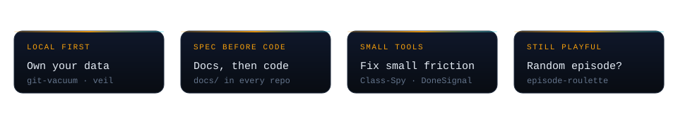
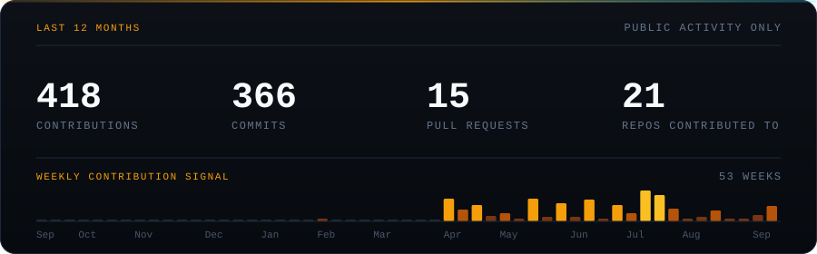

  

<h3 align="center">Software from the sensor to the screen.</h3>

  
  
  

---

I build things for machines, mostly on my own time. The domain I live in is **industrial automation, IoT and edge** — device data, links that drop, and software that has to keep telling the truth when nobody is watching. It's a good place to learn what *"it works"* actually means.

Everything here started as a problem I had. Nothing is a demo.

---

### What my repos say about me

  

Open any four of my repos and the same four things turn up. It isn't a strategy — it's just how I like building.

---

### Two I'd show you first

**Class-Spy** · live on the VS Code Marketplace

Hover any class string and see where the CSS actually lives: definitions grouped by file, Tailwind utilities decoded, SCSS `&` nesting resolved, unknown classes flagged, and missing rules created in place. Framework-aware across HTML, React, Vue, Svelte, Astro and Angular, with a workspace index that stays live as files change.

`TypeScript` `VS Code API` `AST` — [source](https://github.com/PrakashSewani/Class-Spy)

**episode-roulette**

A 🎲 Random Episode button inside Netflix and Prime Video. It discovers every episode across every season, picks one with equal odds, and starts playback as if you'd clicked it yourself. No APIs, no server, no account — and it refuses to randomise a catalog it couldn't fully discover.

`TypeScript` `MV3` `Safari` — [source](https://github.com/PrakashSewani/episode-roulette)

---

The rest is in the [repos](https://github.com/PrakashSewani?tab=repositories) — terminal tools, a gateway, a few extensions, and some things built purely because something annoyed me. Poke around; that's the honest picture.

**Want to build something?** I'm open to collaborations and project ideas, the stranger the better. Reach out and tell me what you're thinking.

---

### Tools I reach for

**Languages**

       

**Edge, industrial & realtime**

     

**Platform & cloud**

      

**Data & transport**

       

**Surfaces**

       

---

### Numbers

  

Public repos only — plenty of my work lives in private ones, so read these as a floor, not a ceiling. The panel is generated from the GitHub API by [`scripts/generate-stats.mjs`](./scripts/generate-stats.mjs) and refreshed weekly, so nothing here depends on a third-party image service.

---

  <b>Take whatever is useful.</b> 
  Work history, résumé and the professional side live at <a href="https://prakashsewani.com">prakashsewani.com</a> — this page is just what I make.  
  <a href="mailto:prakashsewani1994@gmail.com">prakashsewani1994@gmail.com</a> · <a href="https://github.com/PrakashSewani?tab=repositories">all repositories</a>

